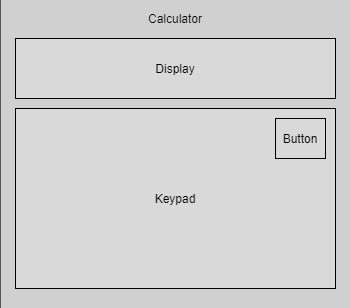

# Simple Calculator In React

## setps:

### 1: Break The UI Into Components

#### components:

a: Calculator/Wrapper

b: Display/Screen

c: Keypad/ButtonBox

d: Button

### 2: Build Static Version

### 3: Identify And Implement State
